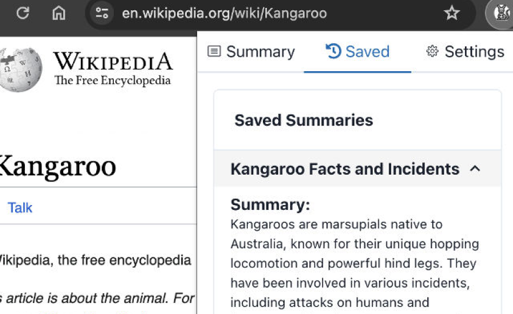

# UX Research

---

## SumarAI 

### **1. General Information**

- **Extension Name:** SumarAI
- **Current Version:** 1.0
- **Developer/Company:** jimbojumbo.dev
- **Chrome Web Store Link:** [SumarAI Extension](https://chromewebstore.google.com/detail/sumarai/mkkjeikhldaeolgmcclafecidaggcacc?hl=es)

---

### **2. Purpose and Functionality**

- **Primary Purpose:**  
  Instantly summarize articles on the web using ChatGPT.

- **Key Features:**
  1. **Right-click Summarization:** Quickly analyze articles with a simple right-click.
  2. **Formatted Summaries:** Generates beautifully formatted summaries tailored to user preferences.
  3. **Customizable Lengths:** Offers three summary lengths: short, medium, and long.
  4. **Model Selection:** Allows users to choose the GPT model that best suits their needs.

---

### **3. Compatibility and Requirements**

- **Compatibility:**

  - The extension is compatible with most Chrome versions.

- **Additional Requirements:**

  - External account setup or API key required.

- **Supported Platforms:**
  - Windows, macOS, Linux, ChromeOS.

---

### **4. Usability**

- **Ease of Installation:**  
  Is the installation process straightforward?

- **User Interface (UI):**

  - Is it intuitive and easy to use?
    - It is not intuitive. On first use, it appears as if the tool doesn’t work.
    - The reason for this is that users need to provide an API key, which is not clearly communicated.

- **Documentation and Support:**

  - Are there tutorials, FAQs, or technical support available?
    - No tutorials or FAQs are available. The extension only includes a "Report Issue" button.

- **Accessibility:**
  - Does it follow inclusive design principles?
    - It does not follow inclusive design principles.
      - The experience is not comparable for all users.
      - It lacks consistency and does not provide sufficient control to the user.

---

### **5. Performance**

- **Impact on Browser Performance:**

  - Is it fast, or does it slow down the browser?
    - The extension is fast and does not slow down the browser.

- **Stability:**
  - Does it work without frequent errors or crashes?
    - The extension frequently crashes and encounters many errors.

---

### **6. Security and Privacy**

- **Required Permissions:**

  - Permissions requested during installation:
    - Site access.

- **Privacy Policy:**

  - Is it clear and transparent?
    - The extension does not request additional permissions during installation.

- **Identified Risks:**
  - Potential concerns:
    - Access to sensitive data or browsing history.

---

### **7. Reviews and Reputation**

- **Chrome Web Store Rating:**

  - Average score: 0.0/5.0

- **Number of Reviews:**

  - No ratings or reviews available.

- **Highlighted Comments:**

  - No user comments have been posted.

- **Mentions in Communities/Forums:**
  - The tool is very recent and has no mentions in communities or forums.

---

### **8. Final Assessment**

- **Overall Score (1 to 5):**

  - 2/5

- **Recommended For:**

  - Advanced users familiar with API key setup and customization.

- **Not Recommended For:**
  - General users who may not understand how to obtain and configure an API key.

---

## **Sumaroo** 

### **1. General Information**

- **Extension Name:** Sumaroo
- **Current Version:** 0.0.1
- **Developer/Company:** mlpierce22
- **Chrome Web Store Link:** [Sumaroo Extension](https://chromewebstore.google.com/detail/sumaroo/dkkkglkmmipnbaagbjgjdjdjailghmgk?hl=es)

---

### **2. Purpose and Functionality**

- **Primary Purpose:**  
  Provides concise, skimmable summaries of web content to enhance readability and improve information retention.

- **Key Features:**
  1. **Quick Summaries:** Converts lengthy pages into easily digestible summaries.
  2. **Gain Insights:** Highlights key points and questions.
  3. **Capture Quotes:** Tracks memorable lines from the content.
  4. **Boost Productivity:** Helps users read more, understand faster, and retain better.

---

### **3. Compatibility and Requirements**

- **Compatibility:**

  - The extension is compatible with most Chrome versions.

- **Additional Requirements:**

  - External account setup or an API key is required.

- **Supported Platforms:**
  - Windows, macOS, Linux, ChromeOS.

---

### **4. Usability**

- **Ease of Installation:**

  - The installation process is straightforward and well-documented with graphics.

- **User Interface (UI):**

  - The extension requires an API key to start.
  - The UI is intuitive for users familiar with browser extensions.
  - Dont includes a right-click shortcut for quick access.
  - Previous summaries are easily accessible via the main navigation interface.
  - Intuitive icons are well-positioned at the top of the interface.
  - Users can delete stored data conveniently.

- **Documentation and Support:**

  - Basic documentation includes an image explaining the API key setup.
  - A GitHub link for further documentation is provided but currently non-functional.

- **Accessibility:**
  - The extension barely follows inclusive design principles.
    - Consistent UI with uniform typography, colors, and text sizes across sections.
    - Good color contrast for readability.
    - Prioritizes content and primary functions.
    - However, it does not provide sufficient user control, such as alternatives to requiring an API key.

---

### **5. Performance**

- **Impact on Browser Performance:**

  - The extension is fast and does not impact browser performance.

- **Stability:**
  - Generally stable, though occasional bugs appear when handling certain types of code.

---

### **6. Security and Privacy**

- **Required Permissions:**

  - The extension requests the following permissions during installation:
    - Site access.

- **Privacy Policy:**

  - The extension requests read and write permissions for the browser during installation.

- **Identified Risks:**
  - Potential concerns include access to sensitive data and browsing history.

---

### **7. Reviews and Reputation**

- **Chrome Web Store Rating:**

  - Average score: 0.0/5.0

- **Number of Reviews:**

  - No reviews or ratings are currently available.

- **Highlighted Comments:**

  - No user comments have been posted.

- **Mentions in Communities/Forums:**
  - As a recent tool, it has no mentions in online communities or forums.

---

### **8. Final Assessment**

- **Overall Score (1 to 5):**

  - 4/5

- **Recommended For:**

  - Advanced users familiar with API key setup and customization.

- **Not Recommended For:**
  - General users who may not understand how to obtain and configure an API key.

---

## **Note Board** 

### **1. General Information**

- **Extension Name:** Note Board
- **Current Version:** 9.0.21
- **Developer/Company:** noteboardapp
- **Chrome Web Store Link:** [Note Board](https://chromewebstore.google.com/detail/note-board-tabl%C3%B3n-de-nota/goficmpcgcnombioohjcgdhbaloknabb?hl=es)

---

### **2. Purpose and Functionality**

- **Primary Purpose:**  
  A tool for saving any data, capturing web content, or storing links to read later.

- **Key Features:**
  1. **Data Storage:** Save any type of data, capture web content, or store links for later reading.
  2. **Kanban Boards:** Organize notes into columns using customizable Kanban boards.
  3. **AI-Generated Notes:** Utilize ChatGPT to create notes with AI-generated responses.
  4. **Collaboration:** Share boards for team-based collaborative work.
  5. **Reminders:** Schedule reminders for specific notes with set dates and times.
  6. **Pop-Up Notes:** Create movable and resizable pop-up windows that remain in place even after restarting your computer.
  7. **Public Boards:** Make boards publicly accessible for broader sharing.
  8. **Cross-Device Synchronization:** Sync notes across devices and share them with others.
  9. **Mobile App Integration:** Use Android and iOS apps to create and access notes with photos from your phone.
  10. **Color Coding:** Assign colors to notes to categorize tasks (e.g., yellow for personal, green for work).
  11. **Resizable Notes:** Move and resize notes freely on your workspace.
  12. **Editing Flexibility:** Double-click on notes to edit or copy-paste their content.

---

### **3. Compatibility and Requirements**

- **Compatibility:**

  - The extension is compatible with most modern Chrome versions (version 85 and above).

- **Additional Requirements:**

  - An external account setup is necessary to enable synchronization.
  - An API key is required for certain advanced features like AI-generated notes.

- **Supported Platforms:**
  - Windows, macOS, Linux, and ChromeOS are fully supported.
  - Mobile platforms (Android and iOS) are supported via companion apps.

---

### **4. Usability**

- **Ease of Installation:**

  - The installation process is straightforward and well-documented with graphics.

- **User Interface (UI):**

  - When you start using the extension, it redirects you to a new page where you can manage your notes.
  - It generates five default note boards, which can confuse users.
  - You can easily access the web notes you’ve taken, but this should be a primary action and positioned in the main navigation bar.
  - Users can choose the font for their notes.
  - The UI appears outdated, even though the tool is up to date, which may not appeal to modern internet users.
  - There is a lack of consistency; the color contrasts differ across sections.
  - The font, font size, icons, and alerts vary even within the same section.
  - Action buttons such as delete, edit, or share are placed too close to each other, increasing the likelihood of user errors.
  - Stickers can be used on the boards, but the available stickers are low-quality PNGs.
  - The options section is unclear and includes a Google Forms link for sending comments instead of using an email redirection.
  - Some icons do not correspond to the actions they represent.
  - You can display the notes in a presentation mode similar to PowerPoint, but this feature is currently not functioning.
  - It offers an upgrade to a premium version for better organization, which means that the free UI does not prioritize the user experience.

- **Documentation and Support:**

  - The installation page includes images that demonstrate how to use the tool.
  - There is an official website where you can read the documentation and access support.
  - You can also find links to the official Android and iOS apps.

- **Accessibility:**
  - The extension does not follow inclusive design principles.
    - It does not provide a comparable experience; notifications, alt texts, and accessibility features are poorly structured.
    - The color contrast is inadequate, making the text difficult to read against the background, and sensitive help does not offer better control over the page.
    - The design patterns and page layout are often confusing and inconsistent across sections.
    - The board sections may cause discomfort, including nausea or distraction.
    - It does not prioritize the main function of the extension, which is to create notes from web pages.

---

### **5. Performance**

- **Impact on Browser Performance:**

  - The extension is fast and does not impact browser performance.

- **Stability:**
  - Generally stable, it starts to have some issues when you have a linked account.

---

### **6. Security and Privacy**

- **Required Permissions:**

  - The extension requests the following permissions during installation:
    - Read and modify your browsing history
    - Display pop-ups and redirects
    - Automatically download files
    - Access images on websites

- **Privacy Policy:**

  - The extension does not request any permissions to be downloaded. However, it does request certain permissions during usage to provide its features.

- **Identified Risks:**
  - The extension has access to your browsing history, which could be a privacy concern if misused.
  - The ability to open pop-ups and redirects may lead to unwanted interruptions or potential phishing risks if exploited.
  - Automatic downloads could potentially introduce malicious files or software if not properly safeguarded.
  - Access to images could raise privacy concerns depending on the websites you visit and the type of content shared.

---

### **7. Reviews and Reputation**

- **Chrome Web Store Rating:**

  - Average score: 4.8/5.0

- **Number of Reviews:**

  - 7.8k reviews

- **Highlighted Comments:**

  - **Vanessa Vicker**  
    November 15, 2024  
    Very useful, it helps me keep track of my tasks at all times.

  - **GISELLE BOLIVAR AK**  
    October 7, 2024  
    I like the extension so far. It's like a board.

  - **Alexander Gómez**  
    September 18, 2024  
    I like the extension so far. Very useful.

  According to 1 person, this review was not helpful.

- **Mentions in Communities/Forums:**
  - Many of the mentions in forums are about the compatibility with other browsers, such as Firefox.

---

### **8. Final Assessment**

- **Overall Score (1 to 5):**

  - 3/5

- **Recommended For:**

  - Users who want a basic tool to keep track of their tasks and notes, especially those who are comfortable with using extensions and don't mind working with a somewhat outdated user interface.

- **Not Recommended For:**

  - Users seeking a highly polished, user-friendly extension with modern design principles and seamless functionality. Not recommended for those who require a fully accessible experience or advanced features.

---

## **Sticky Notes** 

### **1. General Information**

- **Extension Name:** Sticky Notes 3.8 - Super Quick & Personal
- **Current Version:** 3.8
- **Developer/Company:** stickynotes
- **Chrome Web Store Link:** [Sticky Notes](https://chromewebstore.google.com/detail/sticky-notes-38-super-qui/plpdjbappofmfbgdmhoaabefbobddchk?hl=es)

---

### **2. Purpose and Functionality**

- **Primary Purpose:**  
  Animated Themes, Fonts, Offline, Backup, 1-Click easiest & fastest note taking app inside browser.

- **Key Features:**
  1. **Quick Access:** Open and close the app with just one click.
  2. **Folder Organization:** Easily organize notes into folders with a single click.
  3. **No Window Switching:** Stop switching between windows to take notes.
  4. **In-Browser Experience:** A completely in-browser experience for convenience and ease of use.
  5. **Offline Mode:** Fully functional offline, ensuring no interruptions even without an internet connection.
  6. **Animated Themes (Premium):** Gorgeous, handpicked themes such as Dark Mode, Solar System, Aquarium, Sunset, and more, for a personalized experience.
  7. **Lightning Fast:** Take notes quickly without delays—no need to switch between windows or tabs.
  8. **Focus Mode (Premium):** Remove distractions by enabling Focus Mode, which hides all colorful elements for better concentration.
  9. **Seamless Copy-Paste:** Copy and paste notes without hassle, with an easy interface that lets you paste and close the app in one click.

---

### **3. Compatibility and Requirements**

- **Compatibility:**

  - The app is compatible with most modern Chrome versions (version 85 and above).

- **Additional Requirements:**

  - Backup is required to ensure notes are not lost during uninstallation.
  - Premium features require a paid license for full functionality.
  - Syncing between multiple devices is not available for this app.

- **Supported Platforms:**
  - Windows, macOS, and Linux are fully supported.
  - Mobile platforms (Android and iOS) are not supported for synchronization but the app can be used in a single-device environment.

---

### **4. Usability**

- **Ease of Installation:**

  - The installation process is straightforward and well-documented, with graphics and a dedicated website.

- **User Interface (UI):**

  - The navbar is located on the right side of the extension window, which is an unusual placement.
  - You can change the theme, font, text size, and app size.
  - At the top of the window, there is a folder navigation section where you can display from one to three notes.
  - The bottom section allows you to change the text style, such as making it bold, adding a code block, creating lists, etc.
  - You can create only one additional folder with up to three notes.

- **Documentation and Support:**

  - The installation page includes images that demonstrate how to use the tool.
  - There is an official website where you can read the documentation and access support.

- **Accessibility:**
  - The extension follows inclusive design principles:
    - It provides alt text, and you can customize the color, text size, and font.
    - Each theme has good color contrast.
    - Consistent design patterns and page architecture are maintained.
    - The extension gives users control by providing multiple ways to complete actions and change the layout.

---

### **5. Performance**

- **Impact on Browser Performance:**

  - The extension is fast and does not impact browser performance.

- **Stability:**
  - Generally stable, it doesn’t have any major issues.

---

### **6. Security and Privacy**

- **Required Permissions:**

  - The extension requests the following permissions during installation:
    - This extension requires no special permissions.

- **Privacy Policy:**

  - The extension does not request any permissions to be downloaded.

- **Identified Risks:**
  - There are no risks, as it does not ask for permissions or site access.

---

### **7. Reviews and Reputation**

- **Chrome Web Store Rating:**

  - Average score: 4.5/5.0

- **Number of Reviews:**

  - 4.1k reviews

- **Highlighted Comments:**

  - **Rafhaan Shah**  
    Wonderful notes extension. Pops up easily, does not ask for stupid permissions like 50% of extensions on the store, and just works very well.

  - **Roberto Ciccolella**  
    I am a web developer and often I need to paste some snippets of code to re use on the project I am working on, to use a full featured app like Google Docs or Evernote was overkill and not that convenient since you have to wait the app to load etc. Sticky Notes is a joy to use because it is super fast. Brilliant!

  - **Eyad Shelton**  
    Don't waste your time looking for anything else if you want basic, simple, and easy to use. I like it, just what I was looking for.

- **Mentions in Communities/Forums:**
  - Many of the mentions in forums are about the compatibility with other browsers, such as Firefox.

---

### **8. Final Assessment**

- **Overall Score (1 to 5):**

  - 4.6/5

- **Recommended For:**

  - Users who want a basic tool to keep track of their tasks and notes, especially those who use Google Chrome as their primary browser. It's ideal for users looking for a simple and fast note-taking experience within their browser.

- **Not Recommended For:**
  - Users seeking a multi-platform note-taking solution or advanced features such as collaboration, cross-browser support, or extensive synchronization across devices. Also, users who need a more feature-rich note-taking app with more organizational options may find this tool limited.

---
