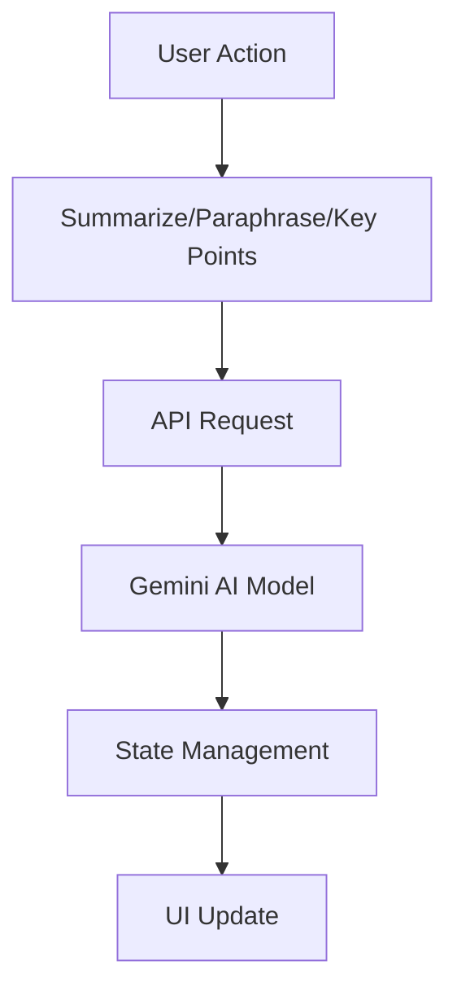

# API Documentation: Geminotes API

## Overview

The Geminotes API provides advanced text processing capabilities using the Gemini AI model. The API supports operations such as summarization, key point extraction, and paraphrasing of text. It uses **Zustand** for state management and handles interactions with the Gemini AI model in an asynchronous manner.

## Key Components

### 1. **useApi Store**

The **useApi** store is responsible for managing API-related states and providing functions for text processing operations such as summarization, paraphrasing, and key point extraction. This store utilizes **Zustand** for state management.

**State Variables:**

- **loading**: A boolean value indicating whether an API request is currently being processed.
- **summary**: A string that holds the summarized text.
- **paraphrased**: A string containing the paraphrased text.
- **keyPoints**: A string containing the key points extracted from the text.

**Functions (Actions):**

- **summarize()**: Requests the Gemini AI model to summarize the input text.
- **extractKeyPoints()**: Requests the Gemini AI model to extract key points from the input text.
- **paraphrase()**: Requests the Gemini AI model to paraphrase the input text.

### 2. **Gemini AI Model Integration**

The API interacts with the **Gemini AI model** to process text. The interaction is handled by sending requests to the model and retrieving the processed data. The Gemini AI supports the following operations:

- **Summarization**: Creates a shortened version of the input text, keeping the main ideas.
- **Key Point Extraction**: Extracts important points or highlights from the input text.
- **Paraphrasing**: Rewrites the input text with different wording while maintaining the original meaning.

### 3. **executeModel Function**

The `executeModel` function is responsible for making the request to the Gemini AI. It abstracts the complexity of interacting with the AI model, allowing the functions to focus on handling the state and API flow.

The function takes the following parameters:

- **model**: The AI model to use (e.g., **summarizer** or **rewriter**).
- **options**: The configuration options for the model (such as text format, summary length, tone for paraphrasing, etc.).

### 4. **State Management with Zustand**

Zustand is used to manage the state within the API. The state includes the results of AI operations (such as summaries, paraphrased text, and key points). Zustand makes it easy to store and manage these values reactively, ensuring the UI is updated whenever the state changes.

The API follows a reactive state management pattern where the UI components subscribe to the state and automatically update when new data (summary, paraphrased text, etc.) is available.

### 5. **Error Handling and Loading State**

The API ensures that only one request is processed at a time by managing a `loading` state. When an API call is in progress, the `loading` state is set to `true`, and no further requests will be made until the current request is completed. This prevents overlapping or redundant requests, ensuring smooth operation.

### Example Flow

1. A user triggers a text processing action (e.g., summarize, paraphrase, or extract key points).
2. The corresponding function (e.g., `summarize`, `paraphrase`, `extractKeyPoints`) is called.
3. The function interacts with the Gemini AI model through the `executeModel` function.
4. The AI processes the text and returns the result.
5. The result is stored in the application state (via Zustand).
6. The UI is automatically updated to reflect the new data (summary, paraphrased text, or key points).

## Diagram

