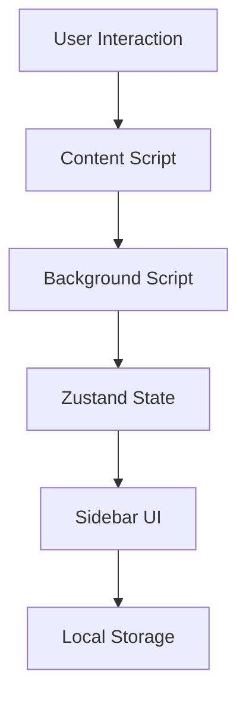

# Architecture of Geminotes

## Overview

Geminotes is a Chrome extension that simplifies note-taking by leveraging AI for summarization and paraphrasing. The architecture is built with modular components adhering to Chrome Manifest V3 specifications. State management and persistence are powered by **Zustand**.

## Key Components

### 1. **Manifest.json**

The central configuration file defining permissions, background scripts, content scripts, and UI-related settings.  
**Purpose:**

- Specify permissions: `activeTab`, `storage`, etc.
- Define entry points: background service worker, content scripts, and sidebar UI.

### 2. **State Management with Zustand**

The state for Geminotes (notes, current notes, etc.) is managed using **Zustand**.

- **Persistence Layer:** Uses `zustand/middleware` with `createJSONStorage` for local storage synchronization.
- **Functionalities:**
  - Adding, editing, and deleting notes.
  - Managing the current note context.
  - Searching notes by ID, title, or tags.

**Code Implementation:**  
The provided `useGeminotes` hook handles all note management operations, enabling centralized state control across the extension's UI.

### 3. **Background Script**

- Acts as the core processing layer, managing events and requests.
- Processes the selected text, interfaces with AI summarization APIs, and handles messaging between components.

**Responsibilities:**

- Listen for messages from the **Content Script** and **Sidebar UI**.
- Fetch AI-based summaries and store notes using the Zustand state hook (`useGeminotes`).

### 4. **Content Script**

- Injected into web pages to interact with the DOM.
- Captures user-selected text and forwards it to the Background Script.

**Example Interaction Flow:**

1. User highlights text.
2. Content Script sends a message with the text to the Background Script.

### 5. **Sidebar UI**

- The **Sidebar UI** serves as the front-end interface for users to view, edit, and manage notes within the browser.
- Utilizes Zustand's `useGeminotes` to fetch and update notes dynamically.
- The sidebar remains open and is accessible at all times, providing users with a persistent workspace for managing notes.

**Technologies:**

- Built using modern front-end frameworks (React/TypeScript with TailwindCSS).
- Displays the list of notes, search functionality, and note details.

### 6. **Persistent Sidebar**

- The sidebar stays open alongside the user's browsing activity, providing continuous access to note-taking features.
- Users can interact with their notes, perform summarization, paraphrasing, and extract key points without interrupting their browsing experience.

## Data Flow

1. **User selects text on a webpage.**
   - Handled by the **Content Script**.
2. The **Content Script** sends a message to the **Background Script**.
3. **Background Script** processes the data and communicates with the AI summarization service.
4. The AI summary is stored in **Zustand** state via `useGeminotes`.
5. Notes and summaries are displayed in the **Sidebar UI**.

## Permissions in Manifest.json

- **activeTab:** Access current tab for text selection.
- **storage:** Enable local note storage and persistence.

## Diagram

